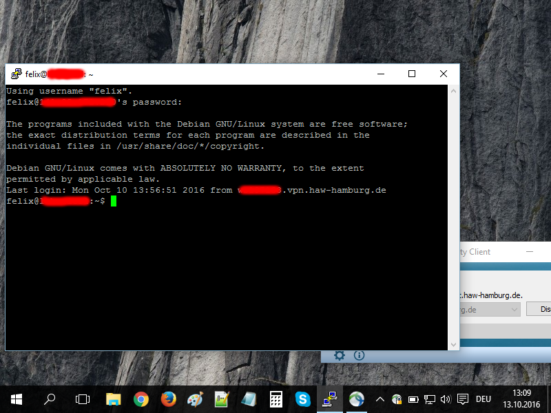

# 3.2 Einführung in die Linux Konsole

Wer Webserver administrieren möchte, der kommt an der [Kommandozeile](https://de.wikipedia.org/wiki/Kommandozeile) von Linux nicht vorbei. In Textform lassen sich Server einfach sicherer und schneller steuern als über grafische Oberflächen. Das sieht dann zum Beispiel so aus:

Bevor wir in Kapitel 3.3 in die praktischen Übungen einsteigen, hier ein paar Literaturtipps vorab:

Eine gute Einführung in die Linux-Kommandozeile bietet [http://linuxcommand.org](http://linuxcommand.org) von William E. Shotts, der auch ein kostenfreies [540-Seiten-Buch](http://linuxcommand.org/tlcl.php) darüber geschrieben hat.

Es gibt sehr viele praktische kleine Programme auf der Kommandozeile. Zur Übersicht eignet sich daher ein Spickzettel ("Cheatsheet") sehr gut. Ein Beispiel für die unzähligen Cheatsheets: [http://cheatsheetworld.com/programming/unix-linux-cheat-sheet/](http://cheatsheetworld.com/programming/unix-linux-cheat-sheet/).

Nicht vergessen werden sollte, dass ein Linux-Server im Internet trotz der guten Sicherheitsarchitektur von Linux ein beliebtes Angriffsziel darstellt und missbraucht werden könnte. Auch bei Linux werden regelmäßig neue Sicherheitslücken und Einfallstore aufgedeckt. Es wäre daher keine gute Idee, einen Server ohne Updates und Überwachung monatelang im Internet herumdümpeln zu lassen. Wer einen Server dauerhaft im Netz belassen möchte, sollte weitere Vorkehrungen treffen. Hier ein paar Einsteigertipps:

* https://developer-blog.net/10-tipps-wie-man-seinen-server-absichert/
* https://www.thomas-krenn.com/de/wiki/Absicherung_eines_Debian_Servers
* https://plusbryan.com/my-first-5-minutes-on-a-server-or-essential-security-for-linux-servers